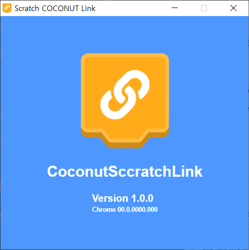
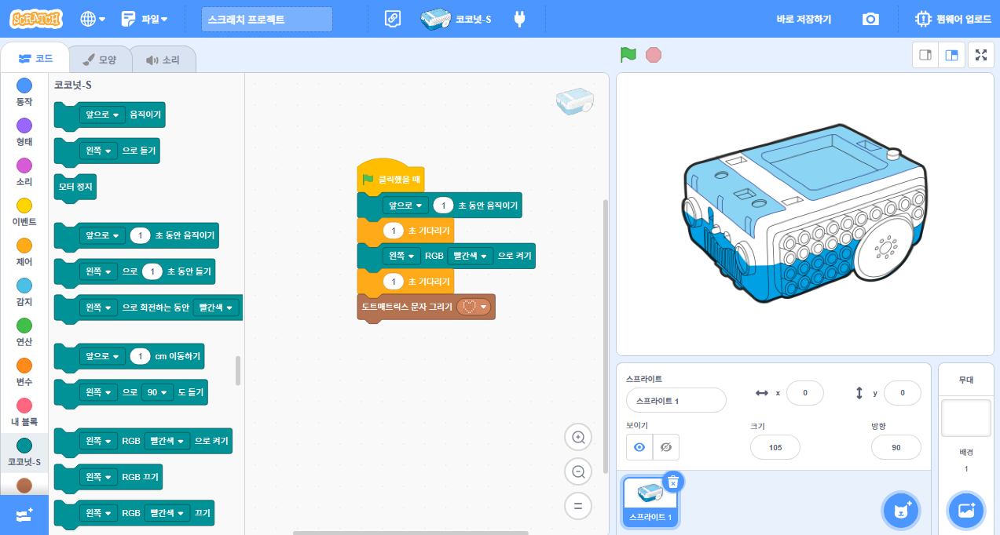

# Coconut Scratch 3.0

### Coconut Scratch is Scratch 3.0 with Coconut and Extensions.
Connect sprites with Coconut Robot  and use them to interact with Coconut Robot

## Getting Started
1. Download and install [Coconut Link](https://github.com/huintech/coconut-link-desktop/releases/latest/)

2. Start the "Coconut Scratch Link" application
    

3. Start Coconut Scratch
    

# Attribution
Thanks to all these great projects that have made this possible:
* [Scratch](https://github.com/LLK/scratch-gui)
* [OpenBlock](https://github.com/openblockcc)
* [ScratchArduino](https://github.com/ottawastem)
